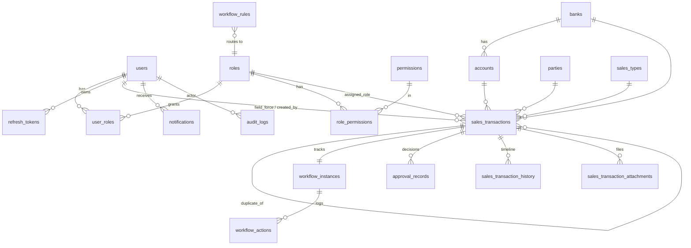

# Paragon – Architecture Proposal (Phase 0)

Status: **APPROVED & IMPLEMENTED** (all phases, recommended defaults for Q1–Q12) – see [IMPLEMENTATION.md](IMPLEMENTATION.md)
Date: 2026-09-26
Implementation notes: Node 24 / Express 5 / Prisma 6 / Zod 4 / React 19 / MUI 7 / Vite 7. Administrators do not hold
create/approve permissions by default (segregation of duties).
Spec: [SPECIFICATION.md](SPECIFICATION.md) (section numbers below as `§n`)

Scope ends at `READY_FOR_PROCESSING`. There is no UiPath, RPA or ERP code anywhere in this design.

---

## 1. System architecture

```
┌──────────────────────────┐        HTTPS (JSON)         ┌──────────────────────────────────────────┐
│  apps/web                │  Authorization: Bearer AT   │  apps/api  (Express, Node 24)            │
│  React + Vite + MUI      │ ──────────────────────────▶ │                                          │
│  TanStack Query          │  refresh: HttpOnly cookie   │  middleware: requestId → pino-http →     │
│  React Hook Form + Zod   │ ◀────────────────────────── │  helmet → cors → rateLimit → auth →      │
└──────────────────────────┘                             │  requirePermission → validate(zod)       │
             ▲                                           │                                          │
             │ imports                                   │  modules/*: controller → service →       │
┌────────────┴─────────────┐                             │            repository → Prisma           │
│ packages/shared          │◀────────── imports ─────────│                                          │
│ Zod schemas, enums,      │                             │  domain: WorkflowEngine, RoutingService, │
│ permission codes, types  │                             │  RuleEngine, DuplicateDetector           │
└──────────────────────────┘                             │  infra: StorageProvider, Notifier,       │
                                                         │         AuditWriter, Outbox              │
                                                         └───────────────┬──────────────────────────┘
                                                                         │
                                          ┌──────────────────────────────┴───────────┐
                                          │ PostgreSQL 17        │ Local file storage │
                                          │ (Prisma migrations)  │ (./storage volume) │
                                          └──────────────────────┴────────────────────┘
                                                     │
                                                     ▼  (future, not built)
                                          domain_events outbox  ──▶  ERP/RPA consumer
```

Key decisions:

| Decision | Choice | Reason |
|---|---|---|
| Repo layout | **npm workspaces monorepo**: `apps/api`, `apps/web`, `packages/shared` | One set of Zod schemas and enums is used by both the frontend (UX validation) and the backend (authoritative validation, §12). No extra tooling (no Nx/Turbo) is needed. |
| Layering | Controller → Service → Repository → Prisma (§29) | Controllers parse and respond only. Services hold the business rules. Repositories are the only code that touches Prisma. |
| Workflow | One **declarative transition table** plus one `WorkflowEngine.execute()` (§4, §15) | Every status change goes through one function. `PATCH /transactions/:id` cannot change status because the Zod schema has no status field. |
| Atomicity | `prisma.$transaction` wraps status + approval record + history + notification + audit + outbox (§35) | Either all of it happens or none of it does. |
| Server state (web) | TanStack Query | Built-in caching, pagination and invalidation, so a global store isn't needed for server data. A small auth context covers the rest. |
| Tables | MUI X DataGrid (MIT edition) in server mode | Covers server-side pagination, sorting and filtering (§24, §25). |
| OpenAPI | `@asteasolutions/zod-to-openapi` | Swagger is generated from the same Zod schemas, so the docs stay in sync with the code (§42). |
| Tests | Vitest + Supertest against a real Postgres test DB | Workflow and locking bugs only show up against a real database. |
| Redis | **Not added** | Rate limiting uses an in-memory store (single instance). Redis can come later (§1). |

---

## 2. Folder structure

```
paragon/
├─ package.json                 # npm workspaces, root scripts (dev, build, lint, test)
├─ docker-compose.yml           # postgres, api, web
├─ .env.example
├─ .editorconfig  .prettierrc  eslint.config.js  tsconfig.base.json
├─ docs/                        # SPECIFICATION.md, ARCHITECTURE.md, ADRs
├─ packages/
│  └─ shared/src/
│     ├─ constants/             # permissions.ts, statuses.ts, actions.ts, correction-categories.ts
│     ├─ schemas/               # transaction.ts, auth.ts, master-data.ts, workflow-rule.ts, common.ts (pagination)
│     └─ types/                 # ApiResponse<T>, ApiError, DTO types inferred from schemas
├─ apps/api/
│  ├─ Dockerfile
│  ├─ prisma/
│  │  ├─ schema.prisma
│  │  ├─ migrations/            # incl. raw SQL: audit append-only trigger, pg_trgm indexes
│  │  └─ seed.ts
│  ├─ src/
│  │  ├─ server.ts  app.ts
│  │  ├─ config/env.ts          # Zod-validated process.env; the app fails fast if a value is missing
│  │  ├─ core/
│  │  │  ├─ errors/             # AppError + Validation/Authentication/Authorization/NotFound/Conflict/BusinessRule
│  │  │  ├─ http/               # ok(), created(), paginated() response helpers, asyncHandler
│  │  │  ├─ middleware/         # requestId, authenticate, requirePermission, validate, errorHandler, rateLimit, upload
│  │  │  ├─ logger.ts           # pino + redaction paths
│  │  │  ├─ db.ts               # Prisma client, withTransaction helper
│  │  │  ├─ context.ts          # AsyncLocalStorage: requestId, user, ip, userAgent
│  │  │  ├─ storage/            # StorageProvider interface, LocalStorageProvider
│  │  │  ├─ notify/             # NotificationChannel interface, InAppChannel
│  │  │  ├─ audit/              # AuditWriter (tx-aware)
│  │  │  └─ outbox/             # DomainEventWriter (tx-aware)
│  │  ├─ modules/
│  │  │  ├─ auth/               # *.routes.ts *.controller.ts *.service.ts *.repository.ts *.openapi.ts
│  │  │  ├─ users/  roles/  master-data/  settings/
│  │  │  ├─ transactions/       # CRUD, search, numbering, access-scope
│  │  │  ├─ workflow/           # state-machine.ts (table), workflow.service.ts, routing.service.ts
│  │  │  ├─ rules/              # rule-engine.ts + rule evaluators
│  │  │  ├─ duplicates/         # duplicate-detector.ts, resolution
│  │  │  ├─ attachments/  notifications/  dashboard/  reports/  audit/
│  │  └─ openapi/registry.ts   # builds the spec and serves /api/docs (dev only)
│  └─ tests/{unit,integration,security,helpers}
└─ apps/web/
   ├─ Dockerfile  nginx.conf
   └─ src/
      ├─ api/                   # axios instance, refresh interceptor, typed endpoint clients
      ├─ components/            # StatusBadge, ConfirmDialog, DataTable, FilterBar, Timeline, PageHeader, MoneyField
      ├─ layouts/               # AppLayout (sidebar + top bar + breadcrumbs), AuthLayout
      ├─ features/{auth,transactions,approvals,users,roles,master-data,workflow,notifications,dashboard,audit,reports}
      │     └─ each: components/, hooks/ (useQuery wrappers), pages/
      ├─ hooks/  store/ (auth context)  routes/ (route table + <RequirePermission>)
      ├─ constants/  types/  utils/  theme.ts
      └─ main.tsx
```

---

## 3. Database ERD



### Tables (all PKs are UUID; `created_at`/`updated_at` are `timestamptz` in UTC)

**Identity and access**
- `users`: email (unique, citext), full_name, password_hash (argon2id), status `ACTIVE|DISABLED|LOCKED`, failed_login_count, locked_until, last_login_at, team_id (nullable; see Q4)
- `roles`: code (unique), name, description, is_system (system roles can't be deleted)
- `permissions`: code (unique), module, description. **Seeded from `packages/shared/constants/permissions.ts`, not editable in the UI**, because code checks against these codes.
- `user_roles` (user_id, role_id) composite PK, `role_permissions` (role_id, permission_id) composite PK
- `refresh_tokens` *(added)*: user_id, token_hash, family_id, expires_at, revoked_at, replaced_by_id, ip, user_agent. Tokens rotate on use, and reusing an old token revokes its whole family.

**Master data** (`status ACTIVE|INACTIVE`; no hard deletes, so historical FKs stay valid)
- `banks`(code, name), `accounts`(code, name, bank_id FK), `parties`(code, name), `sales_types`(code, name, is_special – see Q6)

**Transactions**
- `sales_transactions`
  - id, transaction_number (unique), transaction_date (`date`), field_force_user_id FK, party_id, amount `numeric(18,2)` (never float), bank_id, account_id, payment_reference, payment_reference_norm (trimmed/uppercased, used for duplicate checks), sales_type_id, remarks
  - status (enum), assigned_role_id, assigned_user_id, workflow_rule_id (which routing rule was applied)
  - duplicate_status `NO_DUPLICATE|POSSIBLE_DUPLICATE|EXACT_DUPLICATE`, duplicate_of_id, duplicate_resolution `PENDING|NOT_DUPLICATE|CONFIRMED_DUPLICATE`, duplicate_resolved_by/at
  - rejection_reason, correction_category (enum §19), latest_comment
  - submitted_at, final_approved_at, **approved_snapshot jsonb** (frozen copy of the approved data for future consumers, §49)
  - extra_data jsonb (extension point for future fields, see Q7), version int, created_by, updated_by, timestamps
  - Indexes: transaction_number, status, (status, assigned_role_id), assigned_user_id, created_by, field_force_user_id, party_id, transaction_date, created_at, plus a duplicate-lookup index on (party_id, amount, transaction_date). **pg_trgm GIN** indexes on transaction_number and payment_reference_norm for partial-match search.
  - CHECK constraints: amount > 0; the account's bank must match bank_id (enforced in the service, with a composite FK as backstop)
- `sales_transaction_history`: **the timeline**. transaction_id, action, previous_status, new_status, actor_user_id, actor_role_code, comment, changes jsonb (field-level diff for edits). Insert only.
- `sales_transaction_attachments`: transaction_id, storage_provider, storage_key, original_name, mime_type, size_bytes, sha256, uploaded_by, uploaded_at, deleted_at/by (soft delete keeps the upload history)
- `sequence_counters` *(added)*: (name, year) PK, last_value. Transaction numbers are generated with a row-locked `UPDATE … RETURNING` inside the create transaction, giving `SAL-2026-000001` that resets each year without races.

**Workflow**
- `workflow_instances`: transaction_id (unique), definition_code (`SALES_APPROVAL_V1`), cycle (incremented on each resubmit), started_at, completed_at
- `workflow_actions`: status transitions only. instance_id, action, from_status, to_status, actor, role, cycle, created_at. Insert only.
- `approval_records`: decisions only. transaction_id, stage `SALES_ADMIN|FINANCE`, decision `APPROVED|REJECTED|RETURNED`, approver_id, approver_role, reason, correction_category, cycle. **Insert only; DB trigger blocks UPDATE/DELETE.**
- `workflow_rules`: name, priority (lowest wins), conditions jsonb (`{salesTypeIds?, minAmount?, maxAmount?, partyIds?, isSpecial?}`), target_role_id, is_active, effective_from/to, plus audit fields. Exactly one active rule must be a catch-all default.
- `business_rules` *(added, §36)*: type `MIN_AMOUNT|MAX_AMOUNT|REQUIRED_FIELD|PARTY_RESTRICTION|ACCOUNT_RESTRICTION|APPROVAL_LEVEL`, params jsonb, applies_at `SAVE|SUBMIT|APPROVE`, severity `ERROR|WARNING`, is_active

**Cross-cutting**
- `notifications`: exactly the fields in §22, plus index (user_id, is_read, created_at)
- `audit_logs`: fields from §18. No updated_at. **A PostgreSQL trigger raises an error on UPDATE/DELETE**, so records are append-only even for code bugs or someone with direct DB access through the app role.
- `system_settings`: key PK, value jsonb, description, updated_by (e.g. `business.timezone`, `upload.maxBytes`, `duplicate.possibleWindowDays`)
- `domain_events` *(added, outbox for §49)*: event_type (`TRANSACTION_READY_FOR_PROCESSING`, …), aggregate_type/id, payload jsonb, created_at, published_at NULL. It's written in the same DB transaction as the approval. **Nothing reads it yet.** A future integration polls it, so the app itself won't need changes.

The three workflow-related tables serve different purposes: **history** is the user-facing timeline (every event, including edits and attachments), **workflow_actions** records the state-machine transitions, and **approval_records** records the sign-off decisions used in approval and rejection reports.

---

## 4. Workflow states and transitions

### Persisted states (recommended, see Q1)

| Status | Meaning | Who holds it |
|---|---|---|
| `DRAFT` | Being prepared | Owner (Field Force) |
| `SALES_ADMIN_REVIEW` | Submitted, waiting for Sales Admin | SALES_ADMIN role pool |
| `FINANCE_REVIEW` | SA-approved and routed | ACCOUNTANT **or** TREASURY pool (from routing rule) |
| `CORRECTION_REQUIRED` | Returned with category + reason | Owner |
| `REJECTED` | Terminal decline | none |
| `READY_FOR_PROCESSING` | All approvals complete; frozen | none (future consumer) |
| `CANCELLED` | Withdrawn by owner/admin | none |

The spec's pass-through statuses (`SUBMITTED`, `SALES_ADMIN_APPROVED`, `FINANCE_APPROVED`, `*_REJECTED`) are recorded as **actions** in history and workflow_actions, not stored as statuses. Nobody ever acts on a transaction in those statuses. Storing them would need a second automatic hop, and a failure between the two hops would leave the transaction stuck. The timeline still shows "Submitted", "Sales Admin approved", "Finance approved" and so on.

### Transition table (the only place the rules live)

| From | Action | To | Permission | Guards |
|---|---|---|---|---|
| DRAFT | SUBMIT | SALES_ADMIN_REVIEW | SALES_SUBMIT | owner; rule engine (SUBMIT) passes; duplicate check runs |
| DRAFT, CORRECTION_REQUIRED | CANCEL | CANCELLED | SALES_EDIT | owner (or ADMIN) |
| SALES_ADMIN_REVIEW | SA_APPROVE | FINANCE_REVIEW | SALES_ADMIN_APPROVE | actor ≠ creator/field-force user; EXACT duplicate resolved; routing rule picks target role |
| SALES_ADMIN_REVIEW | SA_RETURN | CORRECTION_REQUIRED | SALES_ADMIN_REJECT | reason + category required |
| SALES_ADMIN_REVIEW | SA_REJECT | REJECTED | SALES_ADMIN_REJECT | reason required |
| FINANCE_REVIEW | FIN_APPROVE | READY_FOR_PROCESSING | FINANCE_APPROVE | actor holds `assigned_role`; actor ≠ creator; **actor ≠ SA approver in this cycle** (segregation of duties); snapshot + outbox event written |
| FINANCE_REVIEW | FIN_RETURN | CORRECTION_REQUIRED | FINANCE_REJECT | reason + category |
| FINANCE_REVIEW | FIN_REJECT | REJECTED | FINANCE_REJECT | reason |
| CORRECTION_REQUIRED | RESUBMIT | SALES_ADMIN_REVIEW | SALES_SUBMIT | owner; cycle++; checks run again |
| SALES_ADMIN_REVIEW, FINANCE_REVIEW | CLAIM / RELEASE / REASSIGN | (same) | review perm / ADMIN | sets assigned_user_id; audited as ASSIGN_TRANSACTION |

Every call to `WorkflowEngine.execute(txId, action, {expectedVersion, reason, category})` runs in a single DB transaction:
1. Lock the row (`SELECT … FOR UPDATE`) and check `version`; a mismatch returns **409**.
2. Look up the transition for (status, action); none means **422 INVALID_TRANSITION**.
3. Check the permission, then the guards (self-approval, segregation of duties, assigned role, duplicate resolved); a failure returns **403/422**.
4. Evaluate the rule engine for this stage.
5. Update the status, assignee, `version+1` and latest_comment/rejection_reason.
6. Insert workflow_action, approval_record, history, notifications, audit_log and outbox event (if applicable).

Field edits by stage (`PATCH`, version required):
- The owner can edit in DRAFT and CORRECTION_REQUIRED.
- A Sales Admin can edit during SALES_ADMIN_REVIEW. The editable fields are configured in the SALES_ADMIN_EDIT field list (default: remarks, sales_type, bank, account, payment_reference).
- Finance (FINANCE_EDIT) can edit only a configured subset.
- Every edit writes a field-level diff to history.

---

## 5. API modules

All endpoints from §30, plus the additions below (marked +). Responses use the §31 envelope. Lists use `?page&limit&sort=field:asc|desc&…filters` and return `{items, page, limit, total}`.

| Module | Endpoints |
|---|---|
| auth | login, refresh (cookie), logout, me |
| transactions | list/search, create, get, patch, submit, resubmit, cancel, history, approve, reject, return, **+claim, +release, +reassign**, **+duplicates (GET), +duplicates/resolve** |
| attachments + | `POST /transactions/:id/attachments` (multipart), `GET …/attachments`, `GET /attachments/:id/download`, `DELETE /attachments/:id` (soft delete) |
| master-data | banks, accounts (`?bankId=`), parties (search, since this list may be large), sales-types |
| users / roles | as spec, **+GET /permissions**, **+PUT /roles/:id/permissions**, **+PUT /users/:id/roles**, **+POST /users/:id/reset-password** |
| workflow | rules CRUD, **+POST /workflow/rules/simulate** (shows which role a sample transaction would route to) |
| rules + | `/business-rules` CRUD |
| settings + | `GET/PATCH /system-settings` |
| notifications | list, read, **+read-all, +unread-count** |
| dashboard | summary (role-aware; filters per §21) |
| reports + | `GET /reports/{sales,approvals,rejections,user-activity,audit}` and `…/export?format=csv|xlsx` (streamed, permission-scoped) |
| audit | list with filters |
| system + | `GET /health`, `GET /ready`, `/api/docs` (dev only) |

Data scope (§33) is enforced by one `TransactionAccessPolicy.scopeWhere(user)` that returns a Prisma `where`. List, get, export, history and attachment downloads all use it, so the rule exists in one place. An out-of-scope ID returns **404, not 403**, so the API doesn't reveal that the transaction exists.

**Wings** (change request 1, 2026-09-28). Every transaction belongs to one business wing (DOC, CBF, Fish, Feed, Milk; managed
as master data). Users are assigned to wings, or to *all wings*. Field Force users create transactions only in their wings.
Sales Admin and finance reviewers see, are notified about and act on only the transactions of their wings (`wingWhere` in
`scopeWhere`/`queueWhere`, and `onWing` in the state-machine guards). Routing rules can be conditioned on wings.

---

## 6. Frontend modules

| Feature | Pages / components |
|---|---|
| auth | LoginPage, silent refresh on load, `usePermissions()`, `<RequirePermission>` and `<Can>` |
| dashboard | Role-aware KPI cards (driven by permissions, not role names), filter bar, recent activity |
| transactions | List (DataGrid server mode, filters, global search), TransactionForm (RHF + shared Zod, dependent Bank→Account dropdown, unsaved-changes guard via `useBlocker`, submit confirm), Detail (fields, attachments, duplicate banner, Timeline) |
| approvals | Queue (claimed / unclaimed), ReviewPage with Approve / Return / Reject dialogs (reason + category required) |
| master-data | Tabbed CRUD for Banks / Accounts / Parties / Sales Types |
| users, roles | User CRUD + role assignment; role editor with a permission matrix |
| workflow | Routing rules (priority ordering, simulate), business rules |
| notifications | Bell with unread count (polls every 30 s; could move to SSE later), list page |
| audit, reports | Filterable tables, export buttons shown only with REPORT_EXPORT |

StatusBadge always shows an icon, text and color together (§40). Routes follow §38, with `/reports` and `/settings` added.

---

## 7. Security considerations

- **Passwords**: argon2id. Login lockout after N failures. Login errors are generic so they don't reveal which emails exist.
- **Tokens**: access JWT, 15 min, kept in memory only (never in localStorage). The refresh token is opaque and random, stored hashed in the DB, sent as an `HttpOnly; Secure; SameSite=Strict; Path=/api/auth` cookie, and rotated with reuse detection. Disabling a user revokes all their tokens. Each access token carries a `tokenVersion`, so changing a user's roles takes effect immediately.
- **CSRF**: only `/auth/refresh` and `/auth/logout` use the cookie. They require the `SameSite=Strict` cookie plus a custom header (`X-Requested-With`) and an Origin check. Every other endpoint uses a Bearer token, which isn't vulnerable to CSRF.
- **RBAC**: `requirePermission('X')` middleware, plus service-level checks (permission ≠ scope). Permissions are loaded per request from a short cache.
- **Input**: Zod on body, query and params with `.strict()`, so unknown fields such as `status` are rejected. Prisma parameterizes all queries. The few raw SQL queries use `Prisma.sql` tagged templates only.
- **XSS**: React escapes output by default. There's no `dangerouslySetInnerHTML`. The API sends `Content-Type: application/json`. A CSP is set via helmet and on the nginx side.
- **Uploads**: allow-list (PDF, JPG, PNG, and XLSX if needed). The real file type is checked from its magic bytes, not the file extension. Size limit comes from settings. Files get random storage keys, live outside the web root and are served via a permission check with `Content-Disposition: attachment` and `X-Content-Type-Options: nosniff`. There's a hook for virus scanning later.
- **Exports**: go through the same scope policy, with a row cap. Cells are sanitized against CSV/Excel formula injection (prefixing `=`, `+`, `-`, `@`).
- **Transport and headers**: helmet, a strict CORS allow-list from env, and rate limits (tight on `/auth/login`).
- **Secrets and logging**: secrets are env-only and validated at boot. `.env` is git-ignored. Pino redacts `authorization`, `cookie`, `password`, `*token*`. Stack traces go to logs only.
- **Integrity**: audit_logs and approval_records are append-only via DB triggers. In production the app DB role should not own the tables, so migrations run as a separate role.

---

## 8. Improvements over the spec (for your approval)

1. **Shared Zod package** so the frontend and backend use identical validation rules.
2. **Fewer persisted statuses** (see §4 and Q1). Transient statuses become history actions.
3. **Reject vs Return are separate** (terminal vs correction). See Q2.
4. **Segregation of duties**: the finance approver can't be the same person who gave Sales Admin approval.
5. **Claim/release** on review queues, so two reviewers don't work on the same item. Optimistic locking remains the safety net.
6. **Outbox table and approved_snapshot**: the future ERP/RPA hand-off will need no changes to the app (§49).
7. **Refresh-token rotation with reuse detection**, stored hashed.
8. **DB-level append-only triggers** for audit and approval records.
9. **Routing-rule simulator** so admins can test a rule before activating it.
10. **pg_trgm indexes** so partial-match search stays fast (§23).
11. **Formula-injection-safe exports** and magic-byte upload validation.
12. **Health/readiness endpoints** for Docker health checks.

---

## 9. Ambiguities and decisions needed

| # | Question | Recommended default |
|---|---|---|
| Q1 | Persist the spec's transient statuses (SUBMITTED, SALES_ADMIN_APPROVED, FINANCE_APPROVED)? | **No.** Record them as actions (§4). |
| Q2 | Is "Reject" different from "Return for correction"? §3.12 says rejected items go back for correction; §8 lists both. | **Yes, they differ.** Return → CORRECTION_REQUIRED (editable, can be resubmitted). Reject → REJECTED (terminal). |
| Q3 | After a Finance return and a resubmit, does the transaction go through Sales Admin again? | **Yes**, with full re-review, because the data changed. |
| Q4 | What is a Sales Admin's or Finance user's "scope" (§33)? Territories, teams, or everything? | **Resolved (2026-09-28): by wing.** All items at their stage *in their wings*, plus items they touched. Territories within a wing are still not modelled. |
| Q5 | Is "Field Force Name" always the logged-in user, or can someone enter on behalf of another FF user? | Defaults to the creator. Users with SALES_VIEW_ALL can pick another FF user. |
| Q6 | What makes a transaction "special" for routing (§9)? | An `is_special` flag on the Sales Type. |
| Q7 | Future fields (§10): schema migrations or admin-defined dynamic fields? | **Typed columns via migrations** (safe, indexable), with `extra_data jsonb` reserved. A dynamic form builder is not in scope. |
| Q8 | Currency: single or multiple? | Single currency, set in system_settings. |
| Q9 | Is at least one attachment required on submit? | Configurable business rule, **on** by default. |
| Q10 | Can a Field Force user cancel a submitted transaction that's still under review? | **No.** Only DRAFT and CORRECTION_REQUIRED can be cancelled (admins can cancel any non-terminal transaction). |
| Q11 | Can a user hold multiple roles? | **Yes** (user_roles M:N). The effective permission set is the union. The self-approval guard still applies. |
| Q12 | Excel export format | `.xlsx` via `exceljs` (one dependency), plus CSV. |

## 10. Risks

- **Scope size**: 17 phases, each with frontend, backend, tests and docs. Mitigation: build and demo a thin end-to-end slice (Phases 1–9) early.
- **Local environment**: Docker Desktop isn't installed on this machine and **WSL2 isn't enabled**. Docker Desktop needs WSL2, admin rights and a reboot. Until then, Postgres could run natively (Windows installer) as a fallback.
- **Routing-rule conflicts**: overlapping rules are resolved by priority, a default rule is required, and the simulator lets admins check the result.
- **Duplicate false positives**: POSSIBLE matches are warnings only. EXACT matches block approval until resolved, never on submit.
- **Timezone**: "Approved today" uses `business.timezone` from settings. All timestamps are stored in UTC.
- **Report size**: exports are streamed and capped. Background jobs (Redis) may be needed later.

---

## 11. Phase 1 deliverables (on approval)

- The monorepo skeleton (workspaces, strict tsconfig, ESLint and Prettier).
- `packages/shared` with its constants.
- The API bootstrap: env validation, pino with requestId, helmet/CORS/rate limit, the error hierarchy, the response envelope, `/health`, and the Swagger shell.
- The web bootstrap: Vite, MUI theme, AppLayout, router, API client.
- `docker-compose.yml` with Postgres and `.env.example`.
- Vitest configured in both apps, plus smoke tests.
- A README with run instructions.
